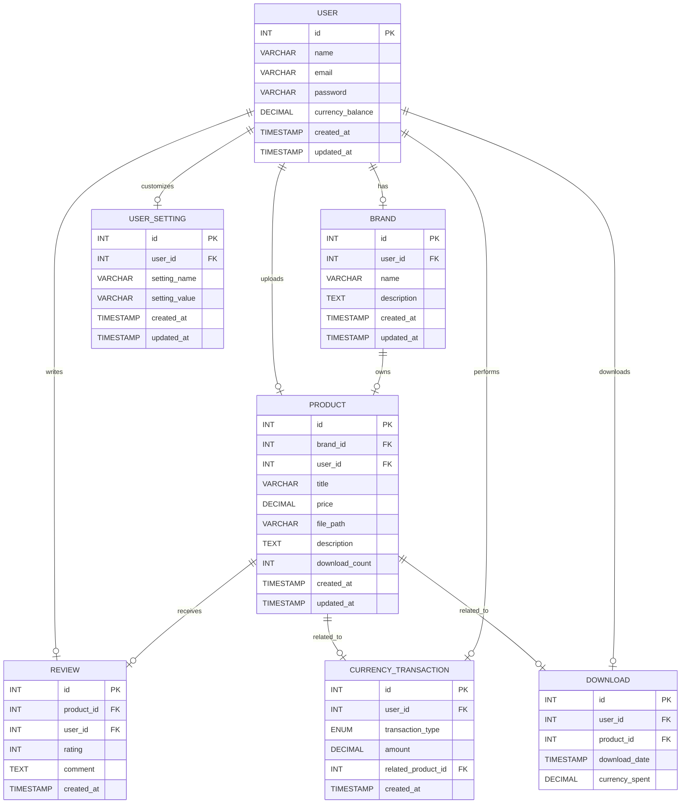

### エンティティリスト

| エンティティ名       | 概要                                                   |
|--------------------|------------------------------------------------------|
| **ユーザー (User)**   | ユーザー情報（ID、名前、メールアドレス、通貨残高など）                  |
| **ブランド (Brand)**  | ユーザーが立ち上げたブランド（名前、説明、ユーザーとの関連など）           |
| **商品 (Product)**    | アップロードされた商品情報（タイトル、価格、ファイルパス、ダウンロード回数など）|
| **レビュー (Review)** | 商品へのユーザーのレビュー（評価、コメント、商品との関連）               |
| **通貨取引 (Currency Transaction)** | 通貨取引の履歴（取引額、取引タイプ、関連する商品またはユーザー） |
| **ダウンロード (Download)** | ユーザーによる商品（画像）のダウンロード履歴（通貨額、ユーザー、商品など） |
| **アカウント設定 (User Setting)** | ユーザーのアカウント設定（通知設定、セキュリティ設定など）        |

---

### 詳細なエンティティ構成

#### 1. **User (ユーザー)**
- ユーザーの基本情報を管理します。

| 属性名               | データ型        | 説明                                         |
|---------------------|-----------------|----------------------------------------------|
| `id`                | INT (PK)        | ユーザーID（ユニーク識別子）                           |
| `name`              | VARCHAR         | ユーザーの名前                                   |
| `email`             | VARCHAR         | ユーザーのメールアドレス                           |
| `password`          | VARCHAR         | ユーザーのパスワード（暗号化）                       |
| `currency_balance`  | DECIMAL(10, 2)  | サイト内通貨残高（Decimal型で管理、例えば100.50など） |
| `created_at`        | TIMESTAMP       | ユーザーアカウント作成日時                           |
| `updated_at`        | TIMESTAMP       | ユーザー情報更新日時                               |

---

#### 2. **Brand (ブランド)**
- ユーザーが立ち上げたブランドを管理します。各ブランドには関連する商品（画像）が紐づきます。

| 属性名             | データ型        | 説明                                           |
|-------------------|-----------------|----------------------------------------------|
| `id`              | INT (PK)        | ブランドID（ユニーク識別子）                           |
| `user_id`         | INT (FK)        | ブランドを立ち上げたユーザーID（`User.id` と関連）       |
| `name`            | VARCHAR         | ブランド名                                       |
| `description`     | TEXT            | ブランド説明文                                    |
| `created_at`      | TIMESTAMP       | ブランド作成日時                                  |
| `updated_at`      | TIMESTAMP       | ブランド情報更新日時                              |

---

#### 3. **Product (商品)**
- 商品（画像）の情報を管理します。タイトル、価格、説明、ダウンロード回数、画像ファイルの保存先などを含みます。商品の価格やダウンロード回数などもここで管理します。

| 属性名              | データ型        | 説明                                             |
|--------------------|-----------------|--------------------------------------------------|
| `id`               | INT (PK)        | 商品ID（ユニーク識別子）                                 |
| `brand_id`         | INT (FK)        | 商品が所属するブランドID（`Brand.id` と関連）              |
| `user_id`          | INT (FK)        | 商品をアップロードしたユーザーID（`User.id` と関連）       |
| `title`            | VARCHAR         | 商品タイトル                                        |
| `price`            | DECIMAL(10, 2)  | 商品の価格                                          |
| `file_path`        | VARCHAR         | 商品（画像）のファイルパス                             |
| `description`      | TEXT            | 商品の説明                                           |
| `download_count`   | INT             | 商品のダウンロード回数                                   |
| `created_at`       | TIMESTAMP       | 商品のアップロード日時                                  |
| `updated_at`       | TIMESTAMP       | 商品情報の更新日時                                    |

---

#### 4. **Review (レビュー)**
- ユーザーが商品に対して投稿したレビューを管理します。評価（星の数）やコメントなどが含まれます。

| 属性名             | データ型        | 説明                                             |
|-------------------|-----------------|--------------------------------------------------|
| `id`              | INT (PK)        | レビューID（ユニーク識別子）                             |
| `product_id`      | INT (FK)        | レビュー対象の商品ID（`Product.id` と関連）                |
| `user_id`         | INT (FK)        | レビューを投稿したユーザーID（`User.id` と関連）             |
| `rating`          | INT             | 商品の評価（例：1〜5の整数）                             |
| `comment`         | TEXT            | レビューコメント                                      |
| `created_at`      | TIMESTAMP       | レビュー作成日時                                      |

---

#### 5. **Currency Transaction (通貨取引)**
- ユーザーが行った通貨取引の履歴を管理します。取引の種類（通貨購入、ダウンロードなど）、取引額などを記録します。

| 属性名             | データ型        | 説明                                           |
|-------------------|-----------------|----------------------------------------------|
| `id`              | INT (PK)        | 取引ID（ユニーク識別子）                             |
| `user_id`         | INT (FK)        | 取引を行ったユーザーID（`User.id` と関連）              |
| `transaction_type`| ENUM('purchase', 'download', 'refund') | 取引タイプ（購入、ダウンロード、返金など）  |
| `amount`          | DECIMAL(10, 2)  | 取引金額                                          |
| `related_product_id`| INT (FK)       | 関連する商品ID（ダウンロードの場合はその商品、購入の場合は購入された商品） |
| `created_at`      | TIMESTAMP       | 取引発生日時                                      |

---

#### 6. **Download (ダウンロード)**
- ユーザーが商品をダウンロードした履歴を記録します。通貨額、ダウンロード日時、関連する商品（画像）などが含まれます。

| 属性名              | データ型        | 説明                                           |
|--------------------|-----------------|----------------------------------------------|
| `id`               | INT (PK)        | ダウンロードID（ユニーク識別子）                           |
| `user_id`          | INT (FK)        | ダウンロードを行ったユーザーID（`User.id` と関連）          |
| `product_id`       | INT (FK)        | ダウンロードされた商品ID（`Product.id` と関連）               |
| `download_date`    | TIMESTAMP       | ダウンロード日時                                    |
| `currency_spent`   | DECIMAL(10, 2)  | ダウンロードに使用された通貨額                          |

---

#### 7. **User Setting (アカウント設定)**
- ユーザーのアカウントに関する設定（通知設定、セキュリティ設定など）を管理します。

| 属性名             | データ型        | 説明                                           |
|-------------------|-----------------|----------------------------------------------|
| `id`              | INT (PK)        | 設定ID（ユニーク識別子）                           |
| `user_id`         | INT (FK)        | 設定が関連するユーザーID（`User.id` と関連）          |
| `setting_name`    | VARCHAR         | 設定項目名（例: `email_notifications`, `theme` など）  |
| `setting_value`   | VARCHAR         | 設定値（例: `true`, `false`, `dark_mode`, `light_mode` など）|
| `created_at`      | TIMESTAMP       | 設定作成日時                                     |
| `updated_at`      | TIMESTAMP       | 設定更新日時                                     |

---

<!-- TODO:ER図がすごく見づらいから、他のものを使ってER図を作成して画像を貼り付ける方法に変更する。 -->

