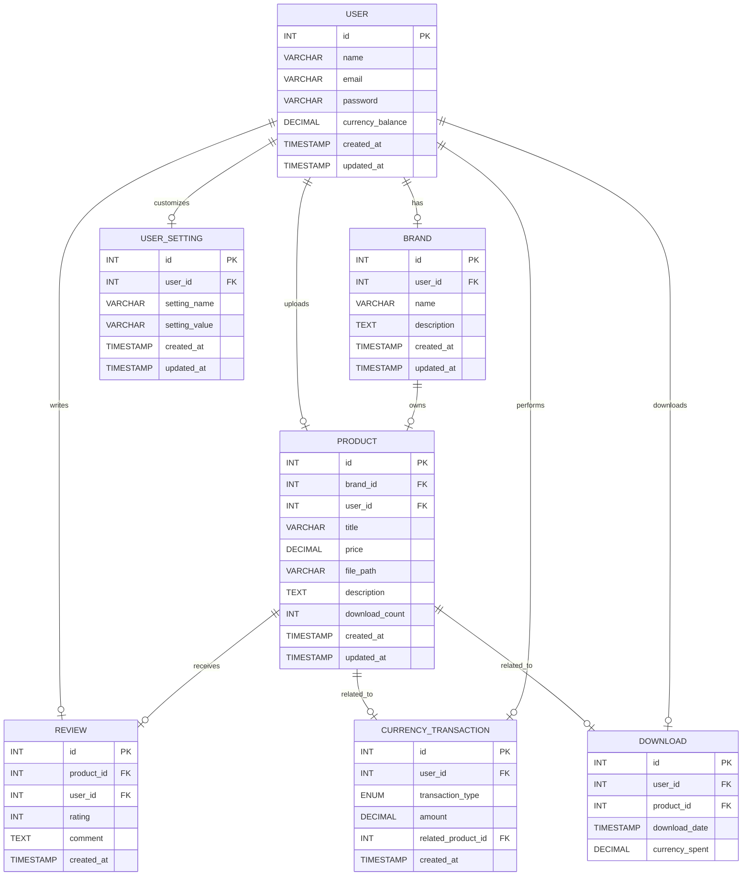

### エンティティリスト

| エンティティ名       | 概要                                                   |
|--------------------|------------------------------------------------------|
| **ユーザー (User)**   | ユーザー情報（ID、名前、メールアドレス、通貨残高など）                  |
| **ブランド (Brand)**  | ユーザーが立ち上げたブランド（名前、説明、ユーザーとの関連など）           |
| **商品 (Product)**    | アップロードされた商品情報（タイトル、価格、ファイルパス、ダウンロード回数など）|
| **在庫 (Stock)**    | アップロードされた商品の在庫情報（商品ID、在庫数など）|
| **コメント (Comment)** | 商品へのユーザーのコメント（評価、コメント）               |
| **通貨取引 (Currency Transaction)** | 通貨取引の履歴（取引額、取引タイプ、関連する商品またはユーザー） |
| **アップロード (Download)** | ユーザーによる商品（画像）のアップロード履歴（通貨額、ユーザー、商品など） |
| **ダウンロード (Download)** | ユーザーによる商品（画像）のダウンロード履歴（通貨額、ユーザー、商品など） |
<!-- | **アカウント設定 (User Setting)** | ユーザーのアカウント設定（通知設定、セキュリティ設定など）        | -->

---

### 詳細なエンティティ構成

#### 1. **User (ユーザー)**
- ユーザーの基本情報を管理します。

| 属性名               | データ型        | 説明                                         |
|---------------------|-----------------|----------------------------------------------|
| `user_id`           | INT (PK)        | ユーザーID（ユニーク識別子）                           |
| `name`              | VARCHAR         | ユーザーの名前                                   |
| `email`             | VARCHAR         | ユーザーのメールアドレス                           |
| `password`          | VARCHAR         | ユーザーのパスワード（暗号化）                       |
| `currency_balance`  | DECIMAL(10, 2)  | サイト内通貨残高（Decimal型で管理、例えば100.50など） |
| `created_at`        | TIMESTAMP       | ユーザーアカウント作成日時                           |
| `updated_at`        | TIMESTAMP       | ユーザー情報更新日時                               |

---

#### 2. **Brand (ブランド)**
- ユーザーが立ち上げたブランドを管理します。各ブランドには関連する商品（画像）が紐づきます。

| 属性名             | データ型        | 説明                                           |
|-------------------|-----------------|----------------------------------------------|
| `brand_id`        | INT (PK)        | ブランドID（ユニーク識別子）                           |
| `user_id`         | INT (FK)        | ブランドを立ち上げたユーザーID（`User.id` と関連）       |
| `name`            | VARCHAR         | ブランド名                                       |
| `description`     | TEXT            | ブランド説明文                                    |
| `created_at`      | TIMESTAMP       | ブランド作成日時                                  |
| `updated_at`      | TIMESTAMP       | ブランド情報更新日時                              |

---

#### 3. **Product (商品)**
- 商品（画像）の情報を管理します。タイトル、価格、説明、ダウンロード回数、画像ファイルの保存先などを含みます。商品の価格やダウンロード回数などもここで管理します。

| 属性名              | データ型        | 説明                                             |
|--------------------|-----------------|--------------------------------------------------|
| `product_id`       | INT (PK)        | 商品ID（ユニーク識別子）                                 |
| `brand_id`         | INT (FK)        | 商品が所属するブランドID（`Brand_id` と関連）              |
| `user_id`          | INT (FK)        | 商品をアップロードしたユーザーID（`User_id` と関連）       |
| `title`            | VARCHAR         | 商品タイトル                                        |
| `price`            | DECIMAL(10, 2)  | 商品の価格                                          |
| `sample_file_path` | VARCHAR         | サンプル商品（画像）のファイルパス                             |
| `file_path`        | VARCHAR         | 商品（画像）のファイルパス                             |
| `description`      | TEXT            | 商品の説明                                           |
| `availability`     | VARCHAR         | 商品のステータス（購入可能、売り切れ、販売中止等）  |
| `created_at`       | TIMESTAMP       | 商品のアップロード日時                                  |
| `updated_at`       | TIMESTAMP       | 商品情報の更新日時                                    |
---

#### 4. **m_tags（タグマスタ）**
- 商品に関連つけるタグの種類を管理します。
| 属性名              | データ型        | 説明                                              |
|--------------------|-----------------|--------------------------------------------------|
| `tag_id`      | INT (PK)        | タグID（ユニーク識別子）                                |
| `tag_name`    | INT (FK)        | タグ名（`tag_id` と関連）                               |
| `created_at`       | TIMESTAMP       | タグが作成された日時                               |
| `updated_at`       | TIMESTAMP       | タグ情報が更新された日時                           |

#### 4. **product_tags（商品タグトラン）**
- 商品に関連つけるタグの種類を管理します。
| 属性名              | データ型        | 説明                                              |
|--------------------|-----------------|--------------------------------------------------|
| `product_tags_id`      | INT (PK)        | 商品タグID（ユニーク識別子）                       |
| `product_id`      | INT (FK)        | 商品ID（`product_id`と関連）                       |
| `tag_id`    | INT (FK)        | タグID（`tag_id` と関連）                               |
| `created_at`       | TIMESTAMP       | 商品タグトランが作成された日時                               |
| `updated_at`       | TIMESTAMP       | 商品タグトランが更新された日時                           |

#### 4. **Stock (在庫)**
- 商品の在庫数を管理するためのエンティティです。このテーブルでは、各商品が現在いくつ在庫として存在するのか、どの倉庫に保管されているのかを管理します。
| 属性名              | データ型        | 説明                                             |
|--------------------|-----------------|--------------------------------------------------|
| `stock_id`         | INT (PK)        | 在庫ID（ユニーク識別子）                           |
| `product_id`       | INT (FK)        | 対象の商品ID（`Product_id` と関連）               |
| `quantity`         | INT             | 商品の在庫数                                       |
| `last_updated`     | TIMESTAMP       | 在庫数が最後に更新された日時                       |

---

#### 5. **Comment (コメント)**
- ユーザーが商品に対して投稿したコメントを管理します。評価（星の数）やコメント内容などが含まれます。

| 属性名             | データ型        | 説明                                             |
|-------------------|-----------------|--------------------------------------------------|
| `review_id`       | INT (PK)        | コメントID（ユニーク識別子）                             |
| `product_id`      | INT (FK)        | コメント対象の商品ID（`Product.product_id` と関連）                |
| `user_id`         | INT (FK)        | レビューを投稿したユーザーID（`User.user_id` と関連）             |
| `rating`          | INT             | 商品の評価（例：1〜5の整数）                             |
| `comment`         | TEXT            | レビューコメント                                      |
| `created_at`      | TIMESTAMP       | レビュー作成日時                                      |

---

#### 6. **Currency Transaction (通貨取引)**
- ユーザーが行った通貨取引の履歴を管理します。取引の種類（通貨購入、ダウンロードなど）、取引額などを記録します。

| 属性名             | データ型        | 説明                                           |
|-------------------|-----------------|----------------------------------------------|
| `id`              | INT (PK)              | 取引ID（ユニーク識別子）                             |
| `user_id`         | INT (FK)              | 取引を行ったユーザーID（`User_id` と関連）|
| `transaction_type`| ENUM('earn', 'spend') | 取引タイプ（獲得、使用）                  |
| `amount`          | DECIMAL(10, 2)        | 取引額（増加または減少）                  |
| `created_at`      | TIMESTAMP             | 取引発生日時                             |

---

#### 7. **Upload (アップロード)**
- ユーザーが商品をアップロードした履歴を記録する。アップロード日時、設定された在庫数等が含まれます。

| 属性名               | データ型        | 説明                                           |
|---------------------|-----------------|----------------------------------------------|
| `upload_id`         | INT (PK)        | アップロードID（ユニーク識別子）                         |
| `user_id`           | INT (FK)        | アップロードを行ったユーザーID（`User_id` と関連）          |
| `product_id`        | INT (FK)        | 商品ID（`Product_id` と関連）                      |
| `initial_quantity`  | INT             | 始めに設定した数量（いくつ入荷させるか）                 |
| `upload_date`       | TIMESTAMP       | アップロードした日時                             |

---

#### 8. **Download (ダウンロード)**
- ユーザーが商品をダウンロードした履歴を記録します。通貨額、ダウンロード日時、関連する商品（画像）などが含まれます。

| 属性名              | データ型        | 説明                                           |
|--------------------|-----------------|----------------------------------------------|
| `download_id`      | INT (PK)        | ダウンロードID（ユニーク識別子）                           |
| `transaction_id`   | INT (PK)        | 取引ID（ユニーク識別子）                             |
| `user_id`          | INT (FK)        | ダウンロードを行ったユーザーID（`User.id` と関連）          |
| `product_id`       | INT (FK)        | 商品ID（`Product.id` と関連）               |
| `product_seq`      | INT             | 商品連番（`Product.product_seq` と関連）               |
| `price`            | DECIMAL(10, 2)  | 取引時の商品の通貨額                                    |
| `download_date`    | TIMESTAMP       | ダウンロード日時                                    |

---

<!-- TODO: フロントエンド作り始めたら、このUser Settingをちゃんと考える。今はいったん無視する。
#### 7. **User Setting (アカウント設定)**
- ユーザーのアカウントに関する設定（通知設定、セキュリティ設定など）を管理します。

| 属性名             | データ型        | 説明                                           |
|-------------------|-----------------|----------------------------------------------|
| `id`              | INT (PK)        | 設定ID（ユニーク識別子）                           |
| `user_id`         | INT (FK)        | 設定が関連するユーザーID（`User.id` と関連）          |
| `setting_name`    | VARCHAR         | 設定項目名（例: `email_notifications`, `theme` など）  |
| `setting_value`   | VARCHAR         | 設定値（例: `true`, `false`, `dark_mode`, `light_mode` など）|
| `created_at`      | TIMESTAMP       | 設定作成日時                                     |
| `updated_at`      | TIMESTAMP       | 設定更新日時                                     |

--- -->

<!-- TODO:ER図がすごく見づらいから、他のものを使ってER図を作成して画像を貼り付ける方法に変更する。 -->

